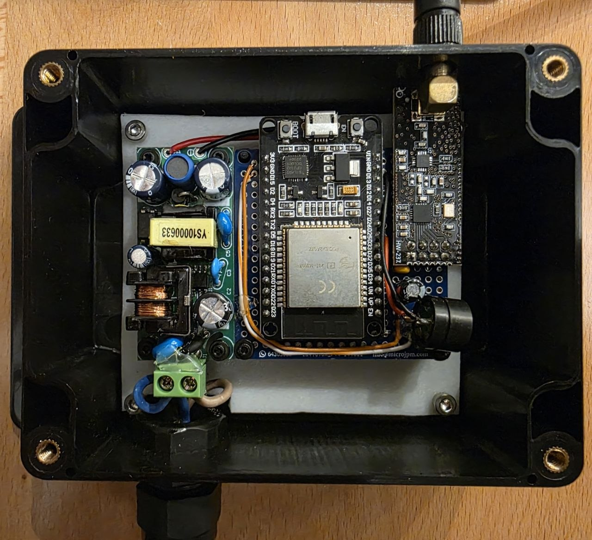

# ESPHome NRF24 Component

An [ESPHome](https://esphome.io/) external component for the **nRF24L01+** 2.4
GHz radio, supporting both **receiving** (RX) and **transmitting** (TX) short
text messages.



It is a thin, easy-to-use wrapper around the excellent
[RF24](https://github.com/nRF24/RF24) library that exposes:

- An `on_receive` trigger that fires whenever a message arrives.
- An `nrf24.send` action to transmit a (templatable) payload from any
  automation.

Both roles are optional and can be used independently — or together — on the
same node.

> ℹ️ Payloads are fixed-size, 32-byte, zero-padded frames (the nRF24L01+
> hardware maximum). This keeps the framing simple and interoperable across
> nodes.

## Hardware & Wiring

The nRF24L01+ is an SPI device. Wire it to your board's SPI bus and pick GPIOs
for the chip-enable (CE), chip-select (CSN) and, optionally, the interrupt
(IRQ) line.

| nRF24L01+ | Purpose            | Example ESP32 GPIO |
|-----------|--------------------|--------------------|
| VCC       | 3.3V (⚠️ not 5V)   | 3V3                |
| GND       | Ground             | GND                |
| SCK       | SPI clock          | GPIO14             |
| MOSI      | SPI MOSI           | GPIO13             |
| MISO      | SPI MISO           | GPIO12             |
| CSN       | SPI chip select    | GPIO15             |
| CE        | Chip enable        | GPIO4              |
| IRQ       | Interrupt (RX only)| GPIO27             |

> 💡 A 10 µF (or larger) capacitor across the module's VCC/GND greatly improves
> stability, especially with the higher-power PA/LNA modules.

## Usage

### 1. Add the SPI bus

The component uses ESPHome's shared SPI bus:

```yaml
spi:
  clk_pin: GPIO14   # SCK
  mosi_pin: GPIO13  # MOSI
  miso_pin: GPIO12  # MISO
```

### 2. Import the external component

Point ESPHome at this repository:

```yaml
external_components:
  - source:
      type: git
      url: https://github.com/kuralabs/esphome-nrf24
    components: [nrf24]
```

You can pin to a specific `ref` (branch, tag or commit) for reproducible
builds:

```yaml
external_components:
  - source:
      type: git
      url: https://github.com/kuralabs/esphome-nrf24
      ref: main
    components: [nrf24]
```

Or, when developing locally with a checkout of this repo:

```yaml
external_components:
  - source:
      type: local
      path: components
```

### 3. Configure the radio

```yaml
nrf24:
  id: radio
  ce_pin: GPIO4
  csn_pin: GPIO15
  irq_pin: GPIO27            # optional; enables interrupt-driven RX
  channel: 76
  pa_level: LOW
  data_rate: 1MBPS
  tx_address: [0xDE, 0xAD, 0xC0, 0xDE, 0x01]
  rx_address: [0xDE, 0xAD, 0xC0, 0xDE, 0x01]
  rx_pipe: 1
```

## Receiving (RX)

Add an `on_receive` automation. The incoming message is available as the
`message` variable (an `std::string`). Presence of `on_receive` is what enables
the receiver.

```yaml
nrf24:
  ce_pin: GPIO4
  csn_pin: GPIO15
  irq_pin: GPIO27
  rx_address: [0xDE, 0xAD, 0xC0, 0xDE, 0x01]
  rx_pipe: 1
  on_receive:
    then:
      - logger.log:
          format: "Got message: %s"
          args: ['message.c_str()']
      - lambda: |-
          if (message == "button_1") {
            // react to the message
          }
```

If `irq_pin` is provided, reception is interrupt-driven; otherwise the
component polls the radio in the main loop.

## Transmitting (TX)

The `nrf24.send` action is always available. The `payload` is templatable, so
you can send a static string or compute one at runtime.

```yaml
binary_sensor:
  - platform: gpio
    name: "Button 1"
    pin:
      number: GPIO32
      mode:
        input: true
        pullup: true
      inverted: true
    on_press:
      - nrf24.send:
          id: radio
          payload: "button_1"
      # ...or a templated payload:
      # - nrf24.send:
      #     id: radio
      #     payload: !lambda 'return "button_1";'
```

When a node has both `on_receive` and uses `nrf24.send`, the component
automatically switches out of listening mode for the duration of each transmit
and returns to listening afterwards.

## Configuration Reference

### Component: `nrf24`

| Option        | Type                | Default                       | Description                                                           |
|---------------|---------------------|-------------------------------|-----------------------------------------------------------------------|
| `id`          | ID                  | auto                          | Component ID, required to reference it from `nrf24.send`.             |
| `ce_pin`      | Pin (**required**)  | —                             | Chip-enable (CE) GPIO.                                                |
| `csn_pin`     | Pin (**required**)  | —                             | SPI chip-select (CSN) GPIO.                                           |
| `irq_pin`     | Pin                 | —                             | Optional IRQ GPIO for interrupt-driven RX. If omitted, RX is polled.  |
| `channel`     | int `0`–`125`       | `76`                          | RF channel (2400 MHz + channel).                                      |
| `pa_level`    | enum                | `LOW`                         | Power amplifier level: `MIN`, `LOW`, `HIGH`, `MAX`.                   |
| `data_rate`   | enum                | `1MBPS`                       | Air data rate: `1MBPS`, `2MBPS`, `250KBPS`.                           |
| `tx_address`  | list of 5 bytes     | `[0xDE,0xAD,0xC0,0xDE,0x01]`  | Writing pipe address used by `nrf24.send`.                            |
| `rx_address`  | list of 5 bytes     | `[0xDE,0xAD,0xC0,0xDE,0x01]`  | Reading pipe address used when `on_receive` is present.               |
| `rx_pipe`     | int `0`–`5`         | `1`                           | Reading pipe number.                                                  |
| `on_receive`  | Automation          | —                             | Automation triggered on each received message (`message` variable).   |

All nodes that talk to each other must share the same `channel`, `data_rate`,
and matching TX/RX addresses.

### Action: `nrf24.send`

| Option    | Type                | Default  | Description                                   |
|-----------|---------------------|----------|-----------------------------------------------|
| `id`      | ID (**required**)   | —        | The `nrf24` component to transmit with.       |
| `payload` | templatable string  | —        | Message to send (max 32 bytes, zero-padded).  |

## Examples

Complete, ready-to-build configurations live in [`examples/`](examples/):

- [`nrf24-receiver.yaml`](examples/nrf24-receiver.yaml) — an ESP32 that reacts
  to incoming messages (gate buttons + buzzer feedback).
- [`nrf24-transmitter.yaml`](examples/nrf24-transmitter.yaml) — an ESP32 with
  physical buttons that transmit messages.
- [`arduino/nrf24_tx.ino`](examples/arduino/nrf24_tx.ino) — a plain **Arduino**
  transmitter sketch (a battery-powered button remote) that is interoperable
  with a node running this component in RX mode. Match its `PIPE_ADDRESS`,
  channel and data rate to the component's `rx_address`, `channel` and
  `data_rate`.

The examples build against committed **dummy** credentials in
[`examples/secrets.yaml`](examples/secrets.yaml). Replace them with your own
Wi-Fi / API credentials before flashing a real device.

## Testing

The component is build-tested with [tox](https://tox.wiki/), using
[uv](https://github.com/astral-sh/uv) (via the `tox-uv` plugin) to provision
environments. Two complementary environments are provided:

- **`validate`** — fast validation (no toolchain download) of the example
  configs and the self-contained test configs.
- **`compile`** — full ESPHome firmware builds of the self-contained test
  configs on **both supported platforms**
  ([`tests/nrf24-test-esp32.yaml`](tests/nrf24-test-esp32.yaml) and
  [`tests/nrf24-test-esp8266.yaml`](tests/nrf24-test-esp8266.yaml)), each
  exercising the RX and TX code paths. The first run downloads the toolchain.

```bash
uvx --with tox-uv tox               # run both environments
uvx --with tox-uv tox -e validate   # fast config validation only
uvx --with tox-uv tox -e compile    # full firmware build only
```

The examples build against committed **dummy** secrets in
[`examples/secrets.yaml`](examples/secrets.yaml) (throwaway placeholder values),
so no real credentials are required for testing.

## The RF24 library dependency

This component depends on the [RF24](https://github.com/nRF24/RF24) library
(v1.6.2 or later), which ESPHome fetches automatically from the PlatformIO
registry — you do not need to install anything manually.

RF24 versions before 1.6.2 fail to build under modern ESPHome on ESP32, for
reference see [nRF24/RF24#1078](https://github.com/nRF24/RF24/pull/1078).

## License

Licensed under the Apache License, Version 2.0. See [`LICENSE`](LICENSE).

Copyright © 2024-2026 KuraLabs S.R.L
